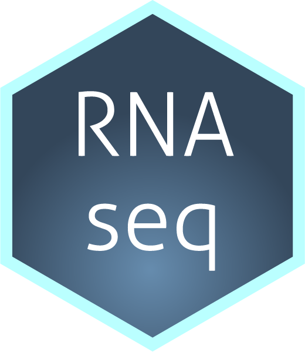

# rnaseq 


A workflow for RNA-seq analysis in Snakemake.


[![Snakemake][shield-snakemake]](https://snakemake.readthedocs.io)
[![MIT license][shield-license]](https://choosealicense.com/licenses/mit)

```js
paddington.pad('foo', 5, '_');   // _foo_
paddington.left('foo', 5, '_');  // __foo
paddington.right('foo', 5, '_'); // foo__
```

Table of Contents
-----------------

  * [Requirements](#requirements)
  * [Usage](#usage)
  * [Contributing](#contributing)
  * [Support and Migration](#support-and-migration)
  * [License](#license)


Requirements
------------

This workflow requires the following to run:

  * [Snakemake][node] 0.10+
  * [Conda][npm] (normally comes with Node.js)


Usage
-----

Ripple is easiest to use when installed with [npm][npm]:


Clone workflow into working directory:

```sh
git clone https://github.com/jma1991/rnaseq.git
```

Configure workflow

Execute workflow and deploy software dependencies via conda:

```sh
snakemake --use-conda
```


Then you can load the module into your code with a `require` call:

```js
var paddington = require('paddington');
```

The `paddington` object has the following methods.

### `paddington.pad( string, length [, character = ' '] )`

Pad a string, distributing the padding equally on the left and right.

`string` is the string we want to pad (_String_).  
`length` is the length we want to pad it to (_Number_).  
`character` is an optional character to pad with (_String_, defaults to `" "`).  
`return` is the padded string (_String_).

```js
// Example
paddington.pad('foo', 5); // returns " foo "
paddington.pad('foo', 5, '_'); // returns "_foo_"
```

### paddington.left( string, length [, character = ' '] )

Pad a string on the left hand side. This method has the same signature as `paddington.pad`.

```js
// Example
paddington.left('foo', 5); // returns " foo"
paddington.left('foo', 5, '_'); // returns "__foo"
```

### paddington.right( string, length [, character = ' '] )

Pad a string on the right hand side. This method has the same signature as `paddington.pad`.

```js
// Example
paddington.right('foo', 5); // returns "foo  "
paddington.right('foo', 5, '_'); // returns "foo__"
```

### Longer strings

When a string is longer than the specified pad length, it will not be trimmed. In this case the string will be returned as-is:

```js
paddington.pad('foobar', 5); // returns "foobar"
```

### Error handling

All of the methods documented above will throw a `TypeError` if an argument is not of the expected type.


Contributing
------------

To contribute to this workflow, clone this repository locally and commit your code on a separate branch. Please write unit tests for your code, and run the linter before opening a pull-request:

```sh
make test  # run all unit tests
make lint  # run the linter
```

You can find more detail in our [contributing guide](#). Participation in this open source project is subject to a [Code of Conduct](#).


Support and Migration
---------------------

Ripple major versions are normally supported for 6 months after their last minor release. This means that patch-level changes will be added and bugs will be fixed. The table below outlines the end-of-support dates for major versions, and the last minor release for that version.

We also maintain a [migration guide](#) to help you migrate.

| :grey_question: | Major Version | Last Minor Release | Support End Date |
| :-------------- | :------------ | :----------------- | :--------------- |
| :heart:         | 3             | N/A                | N/A              |
| :hourglass:     | 2             | 2.1                | 2016-07-04       |
| :no_entry_sign: | 1             | 1.4                | 2015-01-26       |

If you're opening issues related to these, please mention the version that the issue relates to.


Thanks
------

I would like to


License
-------

This workflow is licensed under the [MIT](#) license.  
Copyright &copy; 2020, James Ashmore


[shield-snakemake]: https://img.shields.io/badge/snakemake-≥5.6.0-brightgreen.svg
[shield-license]: https://img.shields.io/badge/license-MIT-blue.svg
